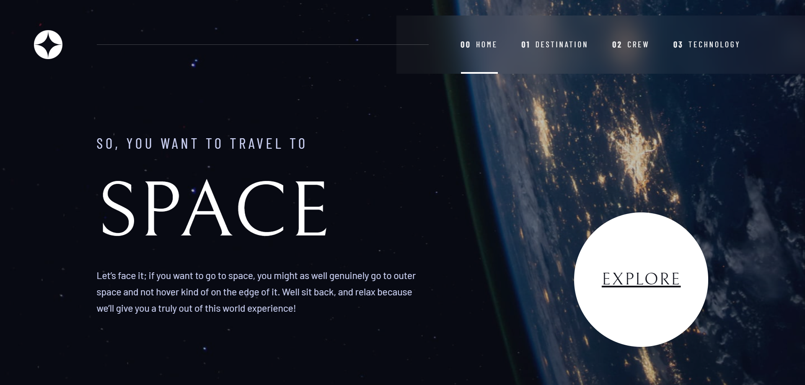

# Frontend Mentor - Space tourism website solution

This is a solution to the [Space tourism website challenge on Frontend Mentor](https://www.frontendmentor.io/challenges/space-tourism-multipage-website-gRWj1URZ3). Frontend Mentor challenges help you improve your coding skills by building realistic projects.

## Table of contents

-   [Overview](#overview)
    -   [The challenge](#the-challenge)
    -   [Screenshot](#screenshot)
    -   [Links](#links)
-   [My process](#my-process)
    -   [Built with](#built-with)
    -   [What I learned](#what-i-learned)
    -   [Continued development](#continued-development)
    -   [Useful resources](#useful-resources)
-   [Author](#author)

## Overview

### The challenge

Users should be able to:

-   View the optimal layout for each of the website's pages depending on their device's screen size
-   See hover states for all interactive elements on the page
-   View each page and be able to toggle between the tabs to see new information

### Screenshot



### Links

-   Solution URL: [GitHub Repository](https://github.com/ozzy1136/space-tourism-website/)
-   Live Site URL: [GitHub Pages](https://ozzy1136.github.io/space-tourism-website/)

## My process

### Built with

-   Semantic HTML5 markup
-   CSS custom properties
-   CSS Grid
-   Mobile-first workflow
-   [PostCSS](https://postcss.org/) - CSS processing
-   [React](https://reactjs.org/) - JS library
-   [Next.js](https://nextjs.org/) - React framework

### What I learned

By far, the code I was most proud of was the [Tabs component](./components/shared/Tabs) I built, based on the [ARIA Authoring Practices Guide Tabs Example](https://www.w3.org/WAI/ARIA/apg/example-index/tabs/tabs-manual.html). The most difficult problem was finding a way to create a button for each tab and have the button linked to a content section. I couldn't loop over a single array to create the buttons, becuase the buttons had a parent `<div role="tablist"/>`, and looping over a single array for each tab would duplicate that `<div role="tablist"/>`. So, I ended up looping over two different arrays: [one](https://github.com/ozzy1136/space-tourism-website/blob/3e2ece0d611f83cddec5db6af9c8de4fda97d354/components/shared/Tabs/index.jsx#L97) to create the button components and [another](https://github.com/ozzy1136/space-tourism-website/blob/3e2ece0d611f83cddec5db6af9c8de4fda97d354/components/shared/Tabs/index.jsx#L132) to display the tab content. There were more challenges to create the Tab component, but I'll probably have to write a blog post about it &#129300;.

I also learned about CSS counters and used them for the navigation menu links. The biggest tip I learned was that the counter() second parameter applies a counter style. I definitely struggled a bit trying to manually add the 0 to the displayed counter &#128514;.

```
.tab {
	/* Has to be reset to wanted initial number - 1, becuase counter will be incremented when it is first used */
	counter-reset: list-item -1;
}

.navListItem {
	/* Counter goes from -1 to 0 */
	counter-increment: list-item;
}

.navLink::before {
	/* Useful second parameter */
	content: counter(list-item, decimal-leading-zero);
}
```

### Continued development

All of the issues left have to do with styling &#129335;. I'll add more issues as I think of them.

#### Stable grid height when switching tabs

On the destination, crew, and technology pages, I couldn't figure out a way to keep the height of the grid consistent on tablet and desktop. This led to an annoying bug where the tablist would move up or down when switching tabs.

The grid height is tied to the size of the image displayed, but the images have different aspect ratios. In the end I couldn't find a way to add the same height to all the images and, at the same time, have the grid take up at least the rest of the viewport height below the navigation bar, as displayed in the mockups.

### Useful resources

-   [ARIA Authoring Practices Guide](https://www.w3.org/WAI/ARIA/apg/) - Great resource with examples of ARIA-compliant components
-   [React ARIA](https://react-spectrum.adobe.com/react-aria/) - Useful React hooks library for creating ARIA-compliant components

## Author

-   Website - [Ozmar Mendoza](https://ozzy1136.github.io/)
-   Frontend Mentor - [@ozzy1136](https://www.frontendmentor.io/profile/ozzy1136)
-   Twitter - [@11_crack](https://www.twitter.com/11_crack)
